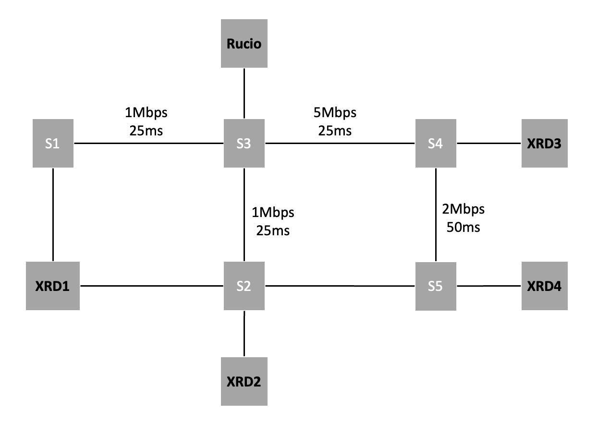
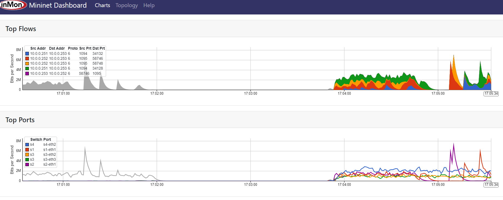

# Demo 1: ALTO-Based Replica Sorting
## Introduction

As described in the [story](https://github.com/openalto/ietf-hackathon/new/documentation/docs/hackathon_comprehensive_story.md), at the hackathon 113, we aimed to augment Rucio reference data with real-time network information and investigate the possible boost in different performance metrics. 

The first step to achieving this integration is to provide the Rucio replica sorting with up-to-date network cost metrics queried dynamically from an ALTO server.

In this document, we first illustrate the changes needed in the Rucio code and environment to utilize ALTO in replica sorting, and then we show the drastic effects of running the Rucio download command with this different sorting scheme. 

To read more about the story or components of the system, please refer to [story](https://github.com/openalto/ietf-hackathon/new/documentation/docs/hackathon_comprehensive_story.md). 


> *NOTE*: Outputs of the commands are ommitted in this document, for detailed output please refer to [the environment setup document](https://github.com/openalto/ietf-hackathon/new/documentation/docs/environment_setup.md).

## Setup 

Please clone the code base for *ietf_hackathon*. 

**Prerequisite**: *git* to install: `apt install git` 

```
git clone https://github.com/openalto/ietf-hackathon
cd ietf-hackathon/docker
``` 
Docker directory contains multiple dokcer-compose reference files to build the demo environment. For this demo you either need [ALTO and Rucio integrated](../docker/) or [ALTO and Rucio Integrated with Rucio monitoring](hackathon_comprehensive_story.md) Dockerfiles. Although we only use s-flow monitoring for this demo, we strongly recommend using the latter as you will have access to full-extent monitoring to work on other demos later. 


Both configurations build and mount different components of Rucio and ALTO on images. Thus, you need to clone those repositories in the **docker** directory. 

| *Do not use sudo and make sure that the repos are present in the working directory (i.e. docker).*

```
git clone -b ietf-hackathon-113 https://github.com/openalto/rucio.git
git clone https://github.com/openalto/alto.git
```

You should then build Rucio dev and XRootD images (for more information on what XRootD is please refer to [story](https://github.com/openalto/ietf-hackathon/new/documentation/docs/hackathon_comprehensive_story.md). These images are located in the `rucio-containers` directory. Provided makefile builds these images automatically. 
```
make build-rucio
```
Then you should build the environments and bring up the containers. 

**Prerequisite**:

- `docker`: <https://docs.docker.com/engine/install/>
- `docker-compose`: <https://docs.docker.com/compose/install/>
- `openvswitch-switch`: <https://www.openvswitch.org/download/>

```
docker-compose -f docker-compose-with-rucio-monit.yml up -d
```

### Debugging guide

1. If the *ssh* image fails to be built, the problem is probably with mounting ssh keys to the image. Make sure that you have cloned the *latest verstion* and have it placed in the working directory.
2. If network volume conflict occured: Please use docker compose down to erase previously set network volumes. ```docker-compose down -v```

For a starting point, we provided a basic topology [here](../utils/rucio_example.py), that you can bring up and test using the following command. 



```
docker-compose -f docker-compose-with-rucio-monit.yml exec mininet python3 /utils/rucio_example.py
```

Make sure that the tests of mininet pass. Since the connectivity between components is required for further progress.

After the topology is built, you can access the rucio node and RSE nodes from the Mininet shell.

Then you can set up the demo rucio datasets and replicas.

```sh
containernet> rc tools/run_tests_docker.sh -ir
```
| Notice: This may take a few minutes to return. 

### Debugging guide
If you encountered errors in the logs output by the above command, you may refer to the Rucio documentation to check for the reason behind specific error codes. In particular "*destination RSE not reachable*" happens when the XRootD image is not built correctly (refer to makefile).


You can also access those nodes using `docker exec` directly (rather than accessing them with host names using mininit).

```sh
$ docker-compose -f docker-compose-with-rucio-monit.yml exec rucio /bin/bash
[root@cf3ad7061320 rucio]#
```

Let's add another replica rule to replicate all the files on XRD4:

```sh
[root@cf3ad7061320 rucio]# rucio add-rule test:container 1 XRD4
```

Now, each test file will have three replicas. But the replicas on XRD3 and XRD4 are still on hold by Rucio.

```sh
[root@cf3ad7061320 rucio]# rucio list-rules --account root
```

We need to start the Rucio daemons to handle the replica rules:

```sh
[root@cf3ad7061320 rucio]# run_daemons
```

Wait for a while, all the replicas will be transferred:

```sh
containernet> rc rucio list-rules --account root
```

> *NOTE*: The transfer will usually not take too long. It usually can be
> finished in 5 min. If you feel it takes too long, you make manually run the
> schedule daemon to make sure the state be synchronized:
>
> ```sh
> containernet> rc rucio-conveyor-poller --run-once --older-than 0
> containernet> rc rucio-conveyor-finisher --run-once
> ```

> *NOTE*: Learn more details from the [Rucio Documentation](http://rucio.cern.ch/documentation/setting_up_demo).

## Testing Rucio with ALTO

Since you have learned how to set up the environment. Let's see how to test your
changes to Rucio and ALTO code.

If you want Rucio to use ALTO client library, you should enter the rucio
container and install the ALTO client first:

```sh
$ docker-compose -f docker-compose-with-rucio-monit.yml exec rucio /bin/bash
[rucio]# cd /opt/alto
[alto]# pip install .
```

> *NOTE*: Every time when you modified the ALTO client library code, if you
> want to make it effective, you should repeat the commands above.

Then, you can start a test ALTO server inside the rucio container:

```sh
# cd /opt/alto/etc
# cp alto.conf.test alto.conf
# cd /opt/alto/tools
# python server.py
```

Then you can switch to another rucio container or shell to test the ALTO-based
replica sorter:

```sh
containernet> rc rucio list-file-replicas --sort=alto --metalink test:file1
```

```
containernet> rc rucio download --dir /tmp --replica-sort alto test:file1
```

The environment has already integrate [sflow-rt]. To enable traffic monitoring,
it is quite simple. You can simply use [mininet-dashboard] to show the
real-time traffic.

Use the following command to install the mininet-dashboard:

```sh
$ docker-compose -f docker-compose-with-rucio-monit.yml exec sflow /sflow-rt/get-app.sh sflow-rt mininet-dashboard
```

## Evalutaion Results

Then you can go to your web browser to see the dashboard at
<http://localhost:8008/app/mininet-dashboard/html/>:



[sflow-rt]: https://sflow-rt.com/download.php

[mininet-dashboard]: https://github.com/sflow-rt/mininet-dashboard

As depicted above using ALTO-based replication sorting in the given topology decreased the download time to a third.  


## Contributions
[Rucio replica sorter](https://github.com/rucio/rucio/blob/master/lib/rucio/core/replica_sorter.py) sorts available RSEs for a DiD download. But the sorting in the main branch is done only using static and imprecise measures (i.e. GeoIP data). In `alto-integration` branch we added [ALTO based sorting](https://github.com/openalto/rucio/blob/605fbfd37495a874709133e59e23bfa7a884bbbf/lib/rucio/core/replica_sorter.py#L176). 
