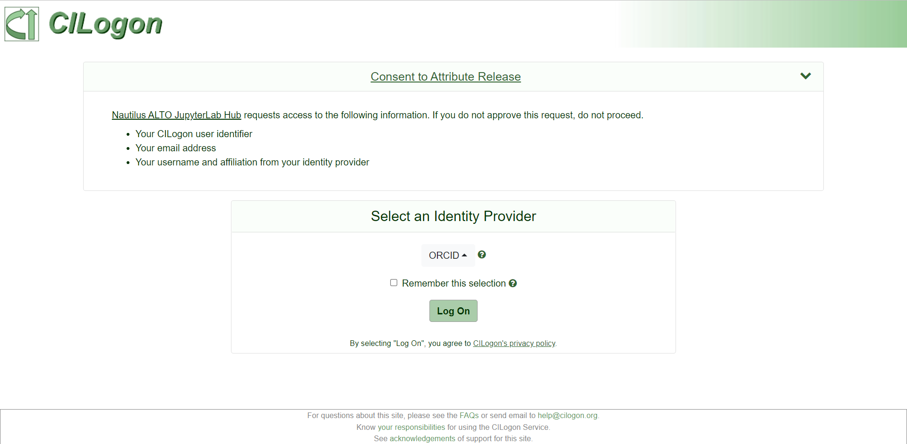
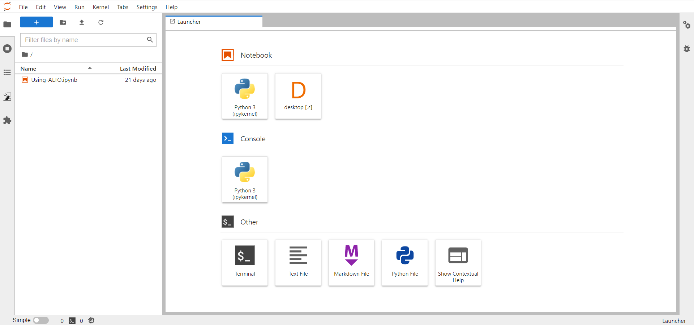

# Environment Setup Guide for Hackathon Developers

> *NOTE*: This is a guide for hackathon developers. To simplify the development
process, we collect with Global Network Advancement Group (GNA-G) and Pacific
Research Platform (PRP) to build up a Kubernetes platform for developers.

## How to Access the PRP Kubernetes Platform

The PRP kubernetes platform provides a JupterHub for user access. To access the
JupterHub, please follow the steps below to set up an account.

1. Contact the administrator (Jensen Zhang <<jingxuan.n.zhang@gmail.com>>) and
   send out the email address via that you want to log in the platform.
   (Check [issue #1](https://github.com/openalto/ietf-hackathon/issues/1))

   > *NOTE*: The platform uses [CILogon](https://www.cilogon.org/) to do the
   authorization. Therefore, you should provide your **institutional email**, or
   your **ORCID**, **GitHub**, **Google**, or **Microsoft** account.

2. Once you received the approval, you can sign up a new account on
   the JupterHub (<https://alto.nrp-nautilus.io/>) using the email address that
   you provided at step 1.

   

3. Log in the JupterHub (<https://alto.nrp-nautilus.io/>) and start a terminal
   or Jupter Notebook to access the development environment.

   

## How to Work on the PRP Kubernetes Platform

Once you start a terminal, the jupyterhub will launch a docker container with
the basic required development environment for you.

The container runs over Ubuntu 20.04. If you need to any additional software
packages, you can temporarily install them on the running container. They will
be kept until you restart your container instance. (Refresh the webpage will not
restart your container instance. But logout your account and re-login will.)

If you want to add any additional software package as permanent items, please
make change on `Dockerfile` of the
[alto/alto-jupyterlab](https://gitlab.nrp-nautilus.io/alto/alto-jupyterlab)
repo, or contact adminstrators (Jensen Zhang <<jingxuan.n.zhang@gmail.com>>,
John Graham <<jjgraham@ucsd.edu>>) to do this.
